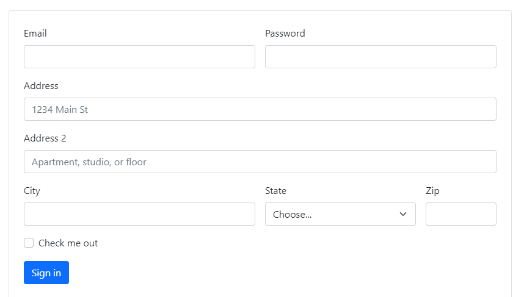
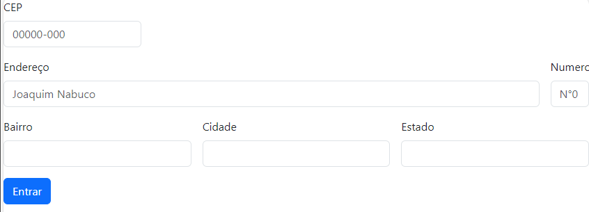

# Índice
[Projeto - ](#projeto---portifolio-para-escrita-do-readme)  
[Descrição](#descri%C3%A7%C3%A3o)  
[Funcionalidades](#funcionalidades)  
[Tecnologias ultilizadas](#tecnologias-ultilizadas)    
[Fontes consultadas](#fontes-consultadas)  
[Autores](#autores)  

# Projeto - 
    *Aula 1
     Utilizando as funcionalidades do bootstrap:

     Nesta aula, exploramos como configurar o Bootstrap que selecionamos, removendo elementos desnecessários e realizando a tradução da página.

     *Aula 2

     Nessa aula mudamos algumas funções para ficar de acordo com a tarefa proposta

ANTES:  
  
DEPOIS:  
 

     *Aula 3 

     Criando o arquivo java colocamos no arquivo html e criamos a função "Limpar formulário" e "Verifição do CEP" usando a expressão <strong> Arrow function </strong> (Em termos simples, uma arrow function é uma forma concisa de escrever uma função em JavaScript. Ela otimiza a escrita do seu código, deixando-o mais limpo, enxuto e aumentando a legibilidade.) 
 
      
      *Aula 4  
     1 (Preenche campos do formulario):Criamos uma variavel chamada "endereco" para a validação dos comandos.  
     2 (função para consumo de API ultilizando a função do tipo assincrona) Criamos uma conexão para os comandos do CEP sejam preenchidos quando um cep válido for adcionado.  
     3 (Verifica se CEP é válido):criamos uma função para achar o CEP e usamos a configuração se ou então para  a validação do cep.  
      
         <strong> Informações: </strong>  
     - Função API As APIs são um conjunto de padrões que fazem parte de uma interface. As APIs permitem a criação de plataformas de maneira mais simples e prática para desenvolvedores. A partir de APIs, é possível criar softwares, aplicativos, programas e plataformas diversas.  
     - Eventos DOM (Document Object Model) são mecanismos do JavaScript que permitem aos desenvolvedores manipular e responder a eventos que ocorrem em elementos HTML. Esses eventos podem ser desde um clique do mouse até o envio de um formulário. 

<strong>Disciplina:</strong> Programação Web I.  
<strong>Professor:</strong>  Leonardo Santiago Sidon da Rocha.  

## 📱Tecnologias utilizadas
 *   
  javascript  
 *  
  HTML 
 *  
  CSS 
  

## 🔠Fontes consultadas
     * https://developer.mozilla.org/pt-BR/docs/Learn/JavaScript/First_steps/Arrays
     * https://getbootstrap.com/docs/5.3/forms/layout/
     * https://cursos.alura.com.br/forum/topico-array-130461
     * https://www.hashtagtreinamentos.com/arrow-function-em-javascript?gad=1&gclid=CjwKCAjwgsqoBhBNEiwAwe5w0wjC8K4YliscMqNiX5lp4cqXFVOvf8SyF2rGgdnv_AMAjMoU0riwjRoC4z0QAvD_BwE
## ✒️Autores
  Isabelle Nascimento de Oliveira  
